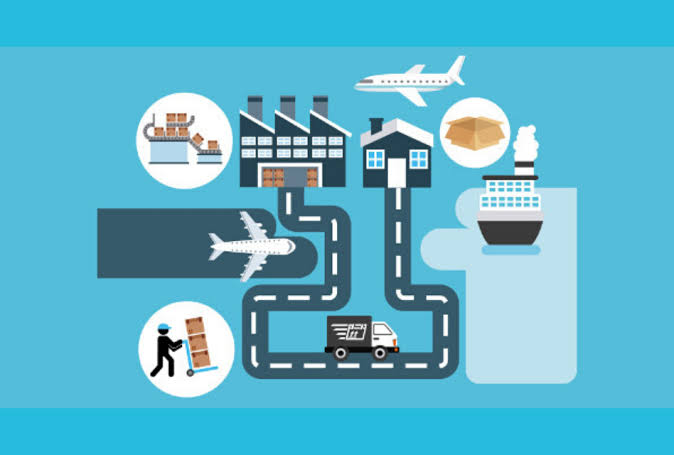

<div align="center">



## Empresa-Logistica-JALogistica-

**Programación Avanzada** · Universidad Distrital Francisco José de Caldas · Septiembre 2026

</div>

<div align="center">
  
  
  
</div>

---

## 👥 Equipo

| Nombre | Código |
| :--- | :---: |
| Ana Sofía Villalobos Pérez | 20242020063 |

---

## 📌 Descripción del Proyecto

Este proyecto implementa un sistema de **gestión logística de transporte** desarrollado en **Java**, utilizando los principios de **Programación Orientada a Objetos (POO)** y la arquitectura **Modelo-Vista-Controlador (MVC)**.

El sistema permite registrar y administrar **conductores, vehículos y rutas**, además de gestionar los recorridos realizados mediante la combinación de estos elementos.

Para cada recorrido registrado, el sistema calcula automáticamente el **tiempo estimado de viaje** a partir de los kilómetros de la ruta y la velocidad del vehículo, así como el **costo del recorrido** utilizando la tarifa por kilómetro del vehículo.

---

## ❓ Pregunta de Investigación

> **¿Cómo desarrollar un sistema de gestión logística que permita administrar conductores, vehículos y rutas, facilitando el registro de recorridos y el cálculo automático de tiempos y costos de transporte?**

---

## 🏗️ Arquitectura del Sistema

El sistema utiliza el patrón **Modelo-Vista-Controlador (MVC)** para separar las responsabilidades de la aplicación.


### Modelo

Contiene las clases que representan la información del sistema:

- `Conductor`
- `Vehiculo`
- `Ruta`

El Modelo se encarga de representar los datos y sus características.

### Vista

La clase `VistaPrinci` es responsable de la interacción con el usuario mediante la consola.

Permite:

- Mostrar el menú principal.
- Solicitar datos.
- Mostrar conductores.
- Mostrar vehículos.
- Mostrar rutas.
- Mostrar recorridos.
- Mostrar mensajes de información y validación.

La Vista **no accede directamente al Modelo**.

### Controlador

Los controladores reciben las acciones del usuario y coordinan la interacción entre la Vista y el Modelo.

El sistema cuenta con:

- `CtldPrinLogistica`
- `CtldConductor`
- `CtldVehiculo`
- `CtldRuta`

Los controladores pueden utilizar la Vista y el Modelo, manteniendo separadas sus responsabilidades.

### Main

- `JALogistica`

Es el controlador que controla a todos, el instancia y manda a correr al codigo 
---

## 🤖 Componentes del Sistema

### 1. 👤 Modelo `Conductor`

Representa a los conductores registrados en el sistema.

| Atributo | Descripción |
| :--- | :--- |
| `nomCond` | Nombre del conductor |
| `C_C` | Número de identificación del conductor |

La clase proporciona métodos `get`, `set` y `toString()` para administrar y representar la información.

---

### 2. 🚛 Modelo `Vehiculo`

Representa los vehículos disponibles para realizar los recorridos.

| Atributo | Descripción |
| :--- | :--- |
| `tipoVehi` | Tipo de vehículo |
| `velocidad` | Velocidad promedio del vehículo |
| `matricula` | Matrícula del vehículo |
| `marca` | Marca del vehículo |
| `tarifaKm` | Tarifa cobrada por cada kilómetro |

La velocidad debe ser **mayor que cero**, ya que se utiliza para calcular el tiempo del recorrido.

---

### 3. 🛣️ Modelo `Ruta`

Representa las rutas disponibles para realizar los recorridos.

| Atributo | Descripción |
| :--- | :--- |
| `nombreRuta` | Nombre o identificación de la ruta |
| `kmRuta` | Distancia de la ruta en kilómetros |

Los kilómetros de la ruta deben ser **mayores que cero**.

---

### 4. 👤 Controlador `CtldConductor`

Gestiona las operaciones relacionadas con los conductores.

**Funciones principales:**

- Registrar conductores.
- Mostrar los conductores registrados.
- Validar la información ingresada.
- Enviar los datos procesados a la Vista.

---

### 5. 🚛 Controlador `CtldVehiculo`

Gestiona las operaciones relacionadas con los vehículos.

**Funciones principales:**

- Registrar vehículos.
- Validar que la velocidad sea mayor que cero.
- Almacenar los vehículos registrados.
- Mostrar los vehículos mediante la Vista.

---

### 6. 🛣️ Controlador `CtldRuta`

Gestiona las rutas y los recorridos realizados.

**Funciones principales:**

- Registrar rutas.
- Mostrar rutas.
- Seleccionar un conductor.
- Seleccionar un vehículo.
- Seleccionar una ruta.
- Registrar el recorrido .
- Calcular el tiempo del recorrido de cada ruta.
- Calcular el costo del recorrido de cada ruta.
- Mostrar los recorridos registrados de cada ruta.


---

### 7. 🎮 Controlador `CtldPrinLogistica`

Es el controlador encargado de coordinar el funcionamiento general del sistema.

Se encarga de:

- Crear la Vista.
- Crear las listas de conductores, vehículos y rutas.
- Crear los controladores específicos.
- Mostrar y controlar el menú principal.
- Coordinar las diferentes operaciones del sistema.

La clase principal `JALogistica` únicamente inicia el controlador principal.

---

### 8. 🖥️ Vista `VistaPrinci`

Es la única clase encargada de la interacción con el usuario.

Utiliza `Scanner` para recibir información desde la consola.

Entre sus funciones se encuentran:

- `mostrarOpciones()`
- `leerTexto()`
- `leerEntero()`
- `leerFloat()`
- `mostrarMensaje()`
- `mostrarConductores()`
- `mostrarVehiculos()`
- `mostrarRutas()`
- `mostrarRecorrido()`
- `mostrarSalir()`

La Vista no contiene la lógica de los cálculos de tiempo o costo.

---

## ⚙️ Funcionalidades del Sistema

| Funcionalidad | Descripción |
| :--- | :--- |
| 👤 Registrar conductor | Permite agregar un conductor al sistema |
| 🚛 Registrar vehículo | Permite registrar un vehículo con sus características |
| 🛣️ Registrar ruta | Permite registrar una ruta y sus kilómetros |
| 📋 Mostrar conductores | Muestra los conductores registrados |
| 🚚 Mostrar vehículos | Muestra los vehículos registrados |
| 🗺️ Mostrar rutas | Muestra las rutas registradas |
| 🔄 Registrar recorrido | Relaciona conductor, vehículo y ruta |
| ⏱️ Calcular tiempo | Calcula automáticamente el tiempo estimado |
| 💰 Calcular costo | Calcula automáticamente el costo del recorrido |
| 📋 Mostrar recorridos | Muestra todos los recorridos registrados |

---

## 🧮 Cálculos del Sistema

### Tiempo del recorrido

El tiempo no es ingresado manualmente por el usuario.

Se calcula utilizando los kilómetros de la ruta y la velocidad promedio del vehículo:

```text
tiempo = kilómetros de la ruta / velocidad del vehículo
```

En el código:

```java
float tiempo = ruta.getKmRuta() / vehiculo.getVelocidad();
```

---

### 💰 Costo del recorrido

El costo se calcula multiplicando los kilómetros de la ruta por la tarifa establecida para el vehículo:

```text
costo = kilómetros de la ruta × tarifa por kilómetro
```

En el código:

```java
float costo = ruta.getKmRuta() * vehiculo.getTarifaKm();
```

---

## 🔄 Gestión de Recorridos

Para registrar un recorrido se deben seleccionar:

```text
Conductor
    +
Vehículo
    +
Ruta
    ↓
Recorrido registrado
    ↓
Cálculo del tiempo
    ↓
Cálculo del costo
```

El sistema permite reutilizar los conductores, vehículos y rutas en diferentes recorridos.

Sin embargo, **no permite registrar dos veces exactamente la misma combinación de conductor + vehículo + ruta**.

Esto evita registrar accidentalmente el mismo recorrido más de una vez.

---

## 📏 Validaciones

El sistema incorpora validaciones para evitar datos incorrectos.

| Dato | Validación |
| :--- | :--- |
| Velocidad | Debe ser mayor que `0` |
| Kilómetros | Deben ser mayores que `0` |
| Selección de conductor | Debe corresponder a un conductor registrado |
| Selección de vehículo | Debe corresponder a un vehículo registrado |
| Selección de ruta | Debe corresponder a una ruta registrada |
| Recorrido | No se permite duplicar la misma combinación |
| Entrada numérica | Se controla para evitar errores de ingreso |

Si no existen conductores, vehículos o rutas registrados, el sistema informa al usuario que debe realizar primero el registro correspondiente.

---

## 🗺️ Flujo General del Sistema
```text
             INICIO
                │
                ▼
       ┌─────────────────┐
       │  Menú Principal │
       └────────┬────────┘
                │
       ┌────────┼───────────────┐
       ▼        ▼               ▼
  Conductor  Vehículo          Ruta
       │        │               │
       └────────┼───────────────┘
                ▼
      Gestión de Recorrido
                │
                ▼
    Seleccionar conductor
                │
                ▼
     Seleccionar vehículo
                │
                ▼
        Seleccionar ruta
                │
                ▼
       Calcular tiempo
                │
                ▼
        Calcular costo
                │
                ▼
       Mostrar recorrido
                │
                ▼
               FIN
```

---

## ⚙️ Tecnología y Herramientas

| Ítem | Detalle |
| :---: | :--- |
| **Lenguaje** | Java |
| **Paradigma** | Programación Avanzada |
| **Arquitectura** | Modelo-Vista-Controlador (MVC) |
| **Interfaz** | Consola |
| **Entrada de datos** | `Scanner` |
| **Colecciones** | `List` y `ArrayList` |
| **IDE** | NetBeans |

---

## 📁 Estructura del Proyecto

```text
JALogistica/
│
├── src/
│   │
│   ├── controlador/
│   │   ├── CtlPrincipal.java
│   │   ├── CtldConductor.java
│   │   ├── CtldVehiculo.java
│   │   └── CtldRuta.java
│   │
│   ├── modelo/
│   │   ├── Conductor.java
│   │   ├── Vehiculo.java
│   │   └── Ruta.java
│   │
│   ├── vista/
│   │   └── VistaPrinci.java
│   │
│   └── JALogistica.java
│
├── README.md
│
└── docs/
    └── diagramas/
        └── ...
```

---

## 🚀 Cómo Ejecutar el Proyecto

1. Abrir el proyecto **JALogistica** en NetBeans IDE 28.
2. Use JDK 25 mínimo
3. Verificar que los paquetes `modelo`, `vista` y `controlador` estén correctamente organizados.
4. Ejecutar la clase `JALogistica`.
5. El programa iniciará el `CtlPrincipal`.
6. Utilizar el menú principal para seleccionar las diferentes opciones.
7. Registrar los conductores, vehículos y rutas necesarios.
8. Registrar los recorridos seleccionando los elementos disponibles.
9. Consultar los recorridos y los cálculos realizados.

---

## 📈 Información Generada

Durante la ejecución del programa se puede consultar:

| Información | Descripción |
| :--- | :--- |
| 👤 Conductores | Conductores registrados |
| 🚛 Vehículos | Vehículos disponibles |
| 🛣️ Rutas | Rutas registradas |
| 🔄 Recorridos | Combinaciones registradas |
| ⏱️ Tiempo | Tiempo calculado para cada recorrido |
| 💰 Costo | Costo calculado para cada recorrido |

---

<h2>1. Diagrama de Clases</h2>
<p align="center">
  
</p>

---
**Universidad Distrital Francisco José De Caldas** Programación Avanzada · Septiembre 2026
